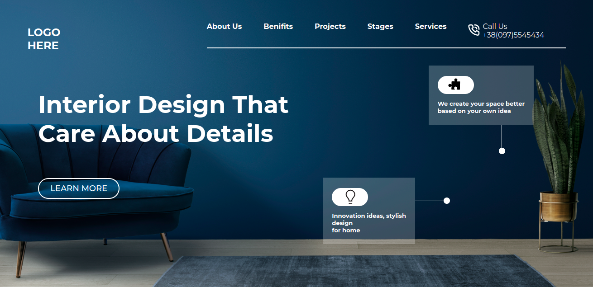

# Interior Design Landing Page

- This project is a Interior Design landing page.This website is designed using pure HTML and CSS. Also, I have made this site responsive using media query by taking two breakpoints.

- It took me 4-5hr to make this project.Please find link of the project below:

---

# Breakpoints

- I have created **Two** Breakpoints to make it responsive.

  - First at **1024px** for small screen laptops.
  - Second at **714px** for Tablets and mobiles.

## Screenshot

- Desktop version screenshot.

  

- Mobile version screenshot.

  

---

## 🛠 Skills learned

HTML, CSS

---

## 🚀 About Me

### Hey, I am Yasir lambawala

- I am born and brought up in Vadodara, Gujarat. I have done my Btech at GTU university and I am currently learning Web-development.

---

## Feedback

- If you have any feedback, please reach me at lambawalay@gmail.com
